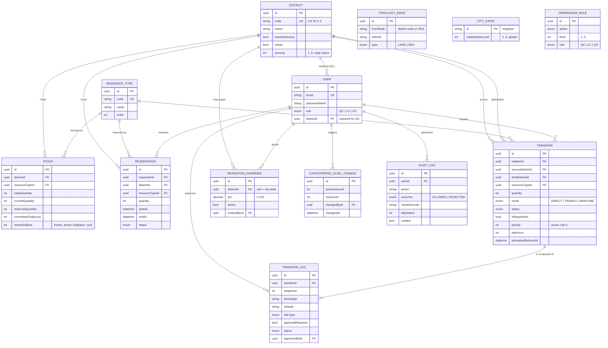

# Diagramme entité-relation — Kaiju Crisis Manager

## Trois points de conception à défendre à l'oral

1. **`TOPOLOGY_EDGE` et `PERMISSION_RULE` sont des tables**, pas des conditions
   codées en dur. Le moteur de règles reçoit le graphe et la matrice en
   paramètres, ce qui le rend testable sans base de données.
2. **`STOCK.retentionBase` est gelé.** Le seuil de rétention ne dérive jamais avec
   le stock courant.
3. **`TRANSFER_LEG` existe.** Une chaîne de transit A→X→Z est deux segments, chacun
   avec sa propre approbation. Sans cette table, le niveau 4 n'est pas
   modélisable proprement.
