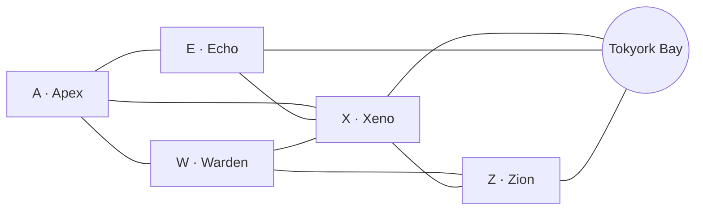

# Topologie de Tokyork

## Graphe

## Faits dérivés, vérifiés par les tests

| Fait | Détail |
|---|---|
| Arêtes terrestres | 7 : A–E, A–W, A–X, E–X, W–X, W–Z, X–Z |
| Accès mer | E, X, Z |
| Enclavés | A, W |
| Hub | X, seul quartier frontalier de tous les autres et de la baie |
| Paires non adjacentes | 3 : A–Z, E–W, E–Z |
| A–Z | **deux** routes à 2 sauts : A–W–Z et A–X–Z |
| E–W | **deux** routes à 2 sauts : E–A–W et E–X–W |
| E–Z | **une seule** route terrestre (E–X–Z) + la route maritime |
| Maritime | uniquement entre E, X et Z ; modélisée comme le pseudo-nœud `SEA` |

Le piège : on croit spontanément que tout transit passe par Xeno. C'est faux pour
A–Z et E–W. Le moteur énumère donc tous les plus courts chemins (voir décision
D9).

## La carte du frontend

`frontend/src/lib/tokyork-map.ts` contient la géométrie vectorielle des cinq
quartiers, de la baie et des terres environnantes, **tracée depuis la carte
fournie avec le sujet** (`docs/kaiju-map.png`).

Procédé :

1. chaque pixel de l'image est classé par couleur en quartier, baie ou arrière-pays ;
2. les traits noirs de bordure sont attribués à leur région la plus proche, de
   sorte que deux quartiers voisins partagent une arête exacte au lieu de laisser
   un interstice de 3 px ;
3. chaque contour est tracé puis simplifié (Douglas-Peucker, tolérance 2 px) ;
4. le résultat est **confronté à la matrice d'adjacence de l'annexe**.

Résultat de cette dernière vérification, en pixels de frontière partagée :

| Paire | Pixels partagés | Annexe |
|---|---:|---|
| Baie–Z | 1352 | adjacent |
| Baie–X | 911 | adjacent |
| Baie–E | 811 | adjacent |
| W–Z | 479 | adjacent |
| E–X | 453 | adjacent |
| A–X | 344 | adjacent |
| A–W | 331 | adjacent |
| A–E | 289 | adjacent |
| W–X | 177 | adjacent |
| X–Z | 83 | adjacent |

Les dix adjacences publiées sont présentes, **et aucune autre**. A–Z, E–W et E–Z
ne se touchent nulle part sur la carte tracée, exactement comme le dit l'annexe.

Cette vérification n'est pas cosmétique : le moteur de règles lit l'adjacence en
base, jamais dans ce fichier, mais une carte qui contredirait les règles
induirait en erreur tous les officiers qui la regardent.

Un piège écarté au passage : la première passe de classification rangeait
l'ombre orange foncée de la côte de Warden dans le rouge d'Apex, ce qui créait
une « île » d'Apex de 6 000 pixels à 200 px du vrai quartier. Le rouge et
l'orange se distinguent par le bleu résiduel : sur le rouge d'Apex le bleu suit
le vert (68 contre 65), sur l'orange de Warden il s'effondre (48 contre 142).
